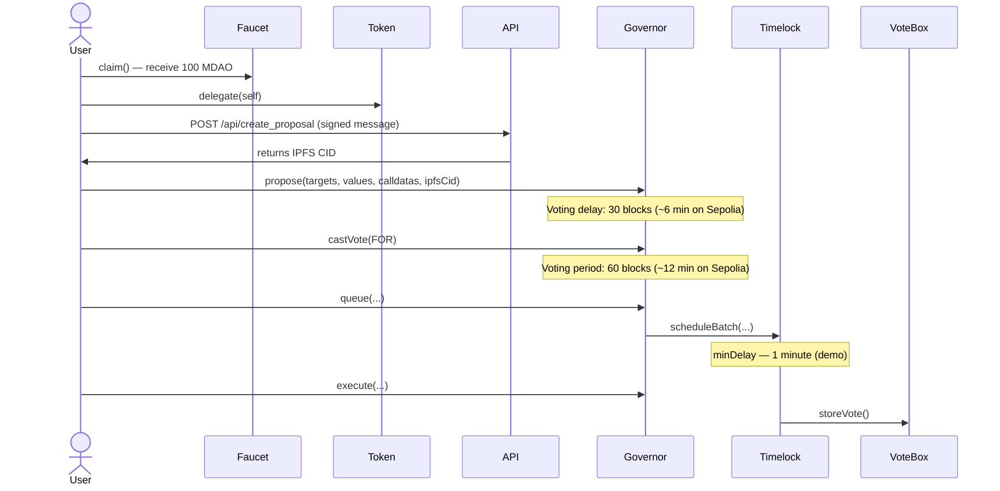

# Mini DAO

[](https://github.com/VxxxxC/mini_dao/actions/workflows/test.yml)
[](https://app.netlify.com/projects/mini-dao/deploys)

A full-stack Web3 governance platform built on **Ethereum Sepolia testnet**. It demonstrates the complete DAO governance lifecycle — from claiming tokens to executing an on-chain proposal through a time-locked controller.

🌐 **Live Demo:** [mini-dao.netlify.app](https://mini-dao.netlify.app)

> 🚨 **Demonstration only.** This project is deployed on Sepolia testnet for learning and showcase purposes. Completing the full voting workflow has no real-world effect.

---

## 📁 Directory Structure

```
mini_dao/
├── contracts/           # Solidity smart contracts (Foundry)
│   ├── src/             # Contract source files
│   ├── test/            # Foundry tests (unit / fuzz / integration / invariant / security)
│   ├── script/          # Deployment scripts
│   ├── lib/             # Dependencies (forge-std, openzeppelin-contracts)
│   └── makefile         # Build, deploy, copy-ABI targets
├── src/                 # SvelteKit frontend
│   ├── lib/
│   │   ├── components/  # UI components
│   │   ├── config/      # Viem, AppKit, env config
│   │   ├── contracts_abi/ # Compiled ABI JSON
│   │   └── auto-import/ # Auto-import globals
│   ├── routes/          # Pages & API endpoints
│   └── assets/          # Static assets (favicon)
├── static/              # Public static files (robots.txt)
├── tests/               # Vitest frontend tests (browser + node projects)
├── .github/workflows/   # CI pipeline
├── netlify.toml         # Netlify deployment config
├── svelte.config.js     # SvelteKit config (Netlify adapter)
├── vite.config.ts       # Vite + Vitest config
├── tailwind.config.js   # Tailwind v3 legacy config
├── foundry.toml         # Foundry config (contracts/)
├── .nvmrc               # Node 20.19
├── .npmrc               # engine-strict=true
├── aderyn.toml          # Solidity static analysis config
└── package.json
```

---

## 🛠 Tech Stack

| Layer           | Tech                                                                 |
| --------------- | -------------------------------------------------------------------- |
| Smart Contracts | Solidity ^0.8.27, Foundry, OpenZeppelin 5.6.1                        |
| Frontend        | SvelteKit v2 + Svelte 5 (runes), TypeScript, Tailwind CSS v4         |
| Web3            | Wagmi v3 + Viem v2, Reown AppKit (WalletConnect)                     |
| Storage         | Filebase S3 → IPFS (off-chain proposal metadata)                     |
| Testing         | Foundry (135 tests: unit / fuzz / integration / invariant / security) · Vitest (browser Playwright Firefox + node) |
| Deploy / CI     | Netlify (adapter-netlify) · GitHub Actions                           |
| Static Analysis | Aderyn (config in aderyn.toml)                                       |

---

## ✨ Features

- **Token Faucet** — Any address can claim 100 MDAO governance tokens (one-time per wallet)
- **Self-delegation** — Auto-delegates voting power to yourself on claim, so you can vote immediately
- **Proposal creation** — Submit governance proposals stored as IPFS metadata, signed and verified by wallet signature (5 min freshness, ≥0.001 ETH anti-spam check)
- **On-chain voting** — Cast For / Against / Abstain votes weighted by MDAO holdings (token-weighted via ERC20Votes)
- **Live countdown timers** — Proposal cards tick down voting delay/period (block-based) and timelock ETA (second-based)
- **Wallet-reactive UI** — Automatically re-checks vote status when MetaMask account switches
- **Queue & Execute flow** — Succeeded proposals surface Queue/Execute buttons routing through TimelockController
- **Fully decentralised post-deploy** — Governor gets PROPOSER/CANCELLER roles, EXECUTOR = address(0), Timelock admin → Timelock itself, deployer admin revoked, VoteBox owned by Timelock
- **Dark mode** — Full dark/light toggle with consistent Tailwind theming across all pages

---

## 🔄 Governance Flow



---

## 🌐 Deployed Contracts (Sepolia)

| Contract   | Address |
| ---------- | ------- |
| MDAO Token | `0x206Bd79Ce059fF7E2B099D6688B1195143a07DCd` |
| Faucet     | `0xB3A42fFd66f31815fF5f81aaf25d7824d7A19dee` |
| Governance | `0x4649bBaD6d87287854Dd8E990d0fE37Bf6941a1b` |
| Timelock   | `0x8f132342fC23231efaAB9601e9aBeb0d5997A66F` |
| VoteBox    | `0x5046c41b1a1EA25270174752c2aC6aedd7672Af2` |

View on [Sepolia Etherscan](https://sepolia.etherscan.io/address/0x4649bBaD6d87287854Dd8E990d0fE37Bf6941a1b).

---

## ⚠️ Demo Configuration

> The governance parameters are intentionally shortened for demonstration. **Do not use these values on mainnet.**

| Parameter        | Demo (Sepolia)                                                       | Recommended for Production    |
| ---------------- | -------------------------------------------------------------------- | ----------------------------- |
| Voting delay     | **30 blocks** (~6 min on Sepolia, ~60s on Anvil w/ 2s block time)    | 1 day minimum                 |
| Voting period    | **60 blocks** (~12 min on Sepolia, ~2 min on Anvil w/ 2s block time) | 1 week minimum                |
| Quorum           | **300 MDAO** (≈ 3 wallets × 100 MDAO)                                | `GovernorVotesQuorumFraction` |
| Timelock minDelay| **1 minute**                                                         | 2 days minimum                |

> ⚠️ `votingDelay` and `votingPeriod` return **block counts**, not seconds. Effective wall-clock time depends on the network's block time (Sepolia ≈ 12s/block, Anvil default ≈ instant — use `anvil --block-time 2` locally).

---

## ⚖️ Pros & Cons / Known Issues

**Pros**

- ✅ Fully decentralised governance — deployer has no special powers post-deploy, treasury held by Timelock
- ✅ 135 contract tests (unit / fuzz / integration / invariant / security) + Vitest dual-project frontend tests, CI fully green
- ✅ Server-verified wallet signature + anti-spam balance check before IPFS upload prevents spam proposals
- ✅ Clean separation of concerns: Token / Faucet / Timelock / Governance / VoteBox

**Cons / Known Issues**

- ⚠️ The `getVotes()` override (returns 1 vote if ≥10 MDAO else 0) **does not affect actual vote counting** in OZ 5.6.1 — `_castVote` uses `token.getPastVotes()` directly, so votes are token-weighted and the "min 10 MDAO" rule is not enforced on-chain
- ⚠️ Demo parameters are extremely short (30/60 blocks voting delay/period, 1 min timelock) — **do not use on mainnet**
- ⚠️ RPC endpoint hardcoded to publicnode Sepolia in both `appKitConfig.ts` and `viem/client.ts` — switch for production
- ⚠️ Convenience `propose(address target)` overload (hardcoded description + `storeVote()`) is unused by the frontend
- ⚠️ `GET /api/get_proposals` endpoint is dead code — proposal listing reads on-chain events + IPFS gateway client-side
- ⚠️ Quorum is hardcoded to 300 MDAO — does not scale with token supply (contract contains WARN comment)

---

## 🚀 Local Setup

**Prerequisites:** [Bun](https://bun.sh) · [Foundry](https://getfoundry.sh) · Node 20.19 (`.nvmrc`)

```bash
git clone https://github.com/VxxxxC/mini_dao.git && cd mini_dao
bun install
```

Create `.env`:

```env
PUBLIC_APPKIT_PROJECT_ID=<reown_project_id>
FILEBASE_ACCESS_KEY=<filebase_key>
FILEBASE_SECRET_KEY=<filebase_secret>
FILEBASE_BUCKET_NAME=<bucket_name>
```

```bash
# Terminal 1 — local Anvil chain
anvil --block-time 2

# Terminal 2 — deploy contracts + copy ABIs to frontend
cd contracts && make deploy-anvil-contract && make build

# Terminal 3 — start frontend dev server
bun dev
```

Open [http://localhost:5173](http://localhost:5173).

### Deploy to Sepolia

```bash
# Requires SEPOLIA_API_RPC_URL env var + foundry keystore account "default_test_wallet"
cd contracts && make deploy-sepolia-contract
```

---

## 🧪 Testing

```bash
# Smart contracts (135 tests)
cd contracts && forge test -vv

# Frontend (Vitest: browser + node projects)
bunx playwright install firefox --with-deps  # first time only
bun run test
```

CI runs both suites on every push/PR to `master`, `main`, `develop` (see `.github/workflows/test.yml`).