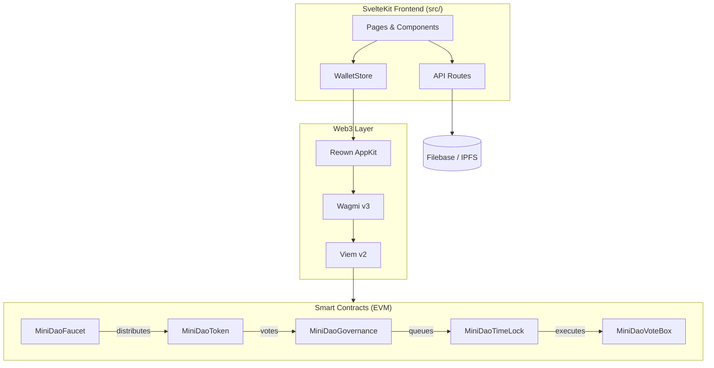
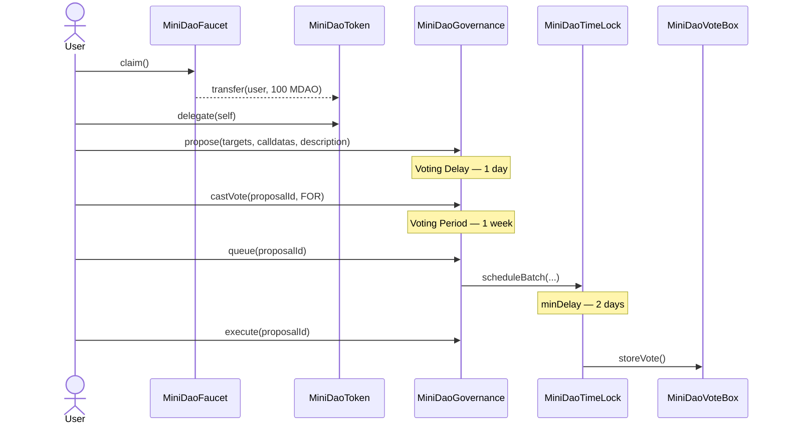

# Mini DAO

A full-stack Web3 governance platform where community members claim governance tokens, delegate voting power, create proposals, vote, and execute approved actions on-chain through a time-locked controller.

---

## 📁 Directory Structure

```
mini_dao/
├── contracts/              # Solidity smart contracts (Foundry)
│   ├── src/                # Contract source files
│   ├── test/               # Foundry test suite (unit / integration / fuzz / invariant / security)
│   ├── script/             # Deployment scripts (DeployDao.s.sol, HelperConfig.s.sol)
│   └── makefile            # Build, deploy, and ABI-copy shortcuts
├── src/                    # SvelteKit frontend
│   ├── lib/
│   │   ├── components/     # Svelte UI components
│   │   ├── config/         # Viem, AppKit, Filebase, env config
│   │   ├── contracts_abi/  # Compiled ABI JSON (synced from contracts/out/)
│   │   ├── stores/         # Svelte reactive stores
│   │   └── types/          # TypeScript type definitions
│   └── routes/             # SvelteKit pages and API endpoints
└── static/                 # Public static assets
```

---

## 🛠 Tech Stack

**Smart Contracts**
- **Solidity ^0.8.24** — Contract language
- **Foundry** — Build, test, and deploy toolchain
- **OpenZeppelin Contracts ^5.x** — Governor, TimelockController, ERC20Votes, ERC20Permit

**Frontend**
- **SvelteKit v2 + Svelte 5** — Full-stack web framework
- **TypeScript** (strict) — Static typing
- **Tailwind CSS v4 + Flowbite-Svelte** — UI styling and components
- **Wagmi v3 + Viem v2** — EVM contract reads/writes
- **Reown AppKit** — Wallet connection (WalletConnect)
- **Filebase SDK / AWS S3** — Off-chain proposal storage on IPFS

---

## ✨ Features

- Token-based governance: propose, vote, queue, and execute on-chain actions
- One-time faucet — any address can claim 100 MDAO tokens to participate
- Time-locked execution — all approved proposals wait a minimum delay before running
- Off-chain proposal metadata stored on IPFS; authenticity verified by wallet signature + 5-min expiry
- Fully decentralised post-deploy — deployer's `DEFAULT_ADMIN_ROLE` is revoked at setup
- ERC20Permit support — gasless token approvals via EIP-712 signatures
- 134-test suite: unit, integration, fuzz, invariant, and security tests

---

## 🔄 Architecture & Governance Flow





### Contracts

| Contract | Role |
|---|---|
| `MiniDaoToken` | ERC20 governance token (MDAO). 1B supply — distributed via faucet; remainder held by timelock. |
| `MiniDaoTimeLock` | `TimelockController`. 2-day minDelay gates all on-chain execution. |
| `MiniDaoGovernance` | Governor. 1-day voting delay, 1-week voting period, 5-token quorum. |
| `MiniDaoFaucet` | One-time claim of 100 MDAO per address. |
| `MiniDaoVoteBox` | Governance-controlled vote store. Owned by the timelock. |

Deployment order: **Timelock → Token → Faucet → Governance → VoteBox**

---

## ⚖️ Pros & Cons / Known Issues

**Pros**
- ✅ Decentralised by design — deployer revokes `DEFAULT_ADMIN_ROLE` post-deploy; all mutations flow through Governor → Timelock
- ✅ Audited base — OpenZeppelin `Governor`, `TimelockController`, `ERC20Votes`, `ERC20Permit`; minimal custom logic
- ✅ Gas-efficient errors — custom errors (`AlreadyClaimed`, `TransferFailed`, `FaucetEmpty`); no `require` strings
- ✅ Signature-verified uploads — off-chain proposals verify wallet signature + 5-min expiry before any IPFS write
- ✅ Network isolation — `HelperConfig.s.sol` separates Anvil / Sepolia params; no hardcoded addresses in scripts

**Cons / Known Issues**
- ⚠️ `QUORUM_VOTES` hardcoded to 5 tokens — does not scale with supply; use `GovernorVotesQuorumFraction` instead
- ⚠️ Proposal pages use mock data (`src/lib/mock_data.ts`) — live IPFS API calls not yet wired up
- ⚠️ `appKitConfig.ts` and `viem/client.ts` are hardcoded to Anvil (chain 31337) — must be updated for production
- ⚠️ Date/time formatting broken in `HomeProposalCard.svelte` and `ProposalCard.svelte` — replace with `Intl.DateTimeFormat`
- ⚠️ Wallet modal overlay conflicts with hamburger dropdown in `Navbar.svelte` (z-index / event propagation)

### Tagged Findings

> ⚠️ Items marked `BUG` or `FIX` must be resolved before production.

#### 🔴 `BUG`
| File | Line | Description |
|---|---|---|
| [Navbar.svelte](src/lib/components/Navbar.svelte#L100) | 100 | Wallet modal overlay conflicts with hamburger dropdown (z-index / event propagation) |

#### 🟠 `FIX`
| File | Line | Description |
|---|---|---|
| [HomeProposalCard.svelte](src/lib/components/HomeProposalCard.svelte#L27) | 27 | Date/time formatting broken — replace with `Intl.DateTimeFormat` |
| [ProposalCard.svelte](src/lib/components/ProposalCard.svelte#L43) | 43 | Same date/time formatting issue |

#### 🟡 `WARN`
| File | Line | Description |
|---|---|---|
| [MiniDaoGovernance.sol](contracts/src/MiniDaoGovernance.sol#L22) | 22 | `QUORUM_VOTES` hardcoded — replace with `GovernorVotesQuorumFraction` |
| [MiniDaoVoteBox.sol](contracts/src/MiniDaoVoteBox.sol#L12) | 12 | Initial owner is `msg.sender`; transfer to timelock post-deploy |
| [appKitConfig.ts](src/lib/config/appKitConfig.ts#L12) | 12, 20 | Network hardcoded to Anvil — switch before production |
| [viem/client.ts](src/lib/config/viem/client.ts#L5) | 5 | Network hardcoded to Anvil — switch before production |

#### 🔵 `IMPORTANT`
| File | Line | Description |
|---|---|---|
| [upload_to_ipfs.ts](src/routes/api/upload_proposal/upload_to_ipfs.ts#L17) | 17 | Signature expiry check — rejects requests older than 5 minutes |
| [upload_to_ipfs.ts](src/routes/api/upload_proposal/upload_to_ipfs.ts#L26) | 26 | Signature verification via `verifyMessage` |
| [upload_to_ipfs.ts](src/routes/api/upload_proposal/upload_to_ipfs.ts#L73) | 73 | IPFS CID extracted from Filebase response header |

---

## 🚀 Local Setup

### Prerequisites

- [Bun](https://bun.sh/) — JavaScript runtime and package manager
- [Foundry](https://getfoundry.sh/) — `curl -L https://foundry.paradigm.xyz | bash`

### Installation

```bash
# Clone
git clone https://github.com/your-username/mini_dao.git
cd mini_dao

# Install frontend dependencies
bun install
```

### Environment Variables

Create a `.env` file at the project root:

```env
VITE_APPKIT_PROJECT_ID=<your_reown_project_id>
VITE_SEPOLIA_RPC_URL=<your_sepolia_rpc_url>
VITE_SEPOLIA_API_RPC_URL=<your_sepolia_api_rpc_url>
FILEBASE_ACCESS_KEY=<your_filebase_access_key>
FILEBASE_SECRET_KEY=<your_filebase_secret_key>
FILEBASE_BUCKET_NAME=<your_filebase_bucket_name>
```

| Variable | Where to get it |
|---|---|
| `VITE_APPKIT_PROJECT_ID` | [cloud.reown.com](https://cloud.reown.com) |
| `VITE_SEPOLIA_RPC_URL` | [Alchemy](https://alchemy.com) or [Infura](https://infura.io) |
| `FILEBASE_ACCESS_KEY` / `FILEBASE_SECRET_KEY` | [console.filebase.com](https://console.filebase.com) |
| `FILEBASE_BUCKET_NAME` | Your IPFS-enabled Filebase bucket name |

### Run Locally (Anvil)

```bash
# Terminal 1 — start local EVM node
anvil

# Terminal 2 — deploy contracts and copy ABIs
cd contracts
make deploy-anvil-contract
make build         # compiles and copies ABIs to src/lib/contracts_abi/

# Terminal 3 — start the frontend
cd ..
bun dev
```

Open [http://localhost:5173](http://localhost:5173).

### Contract Development

```bash
cd contracts
forge build        # compile
forge test -vv     # run all 134 tests
forge fmt          # format
forge snapshot     # gas snapshot
```

### Build for Production

```bash
bun run build:pro
bun run preview
```

> Before deploying, update `src/lib/config/appKitConfig.ts` and `src/lib/config/viem/client.ts` to your target network (Sepolia or mainnet).


