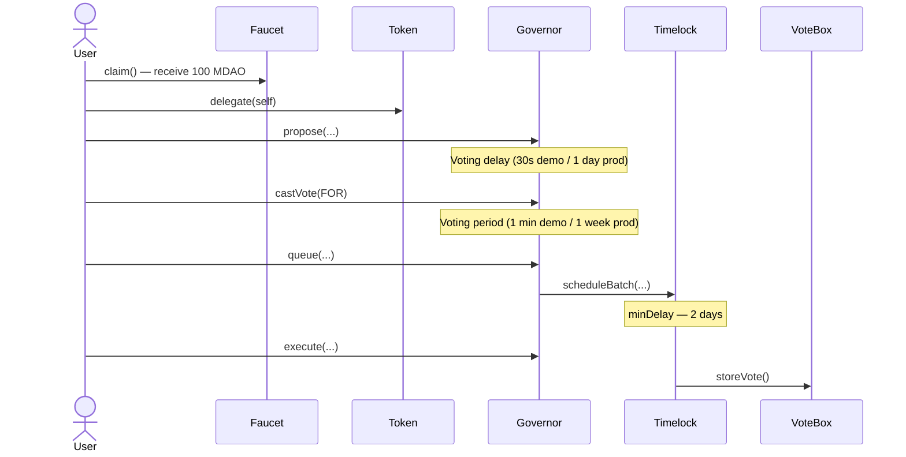

# Mini DAO

[](https://github.com/VxxxxC/mini_dao/actions/workflows/test.yml)

A full-stack Web3 governance platform. Community members claim tokens, delegate voting power, create proposals, vote, and execute approved actions through a time-locked on-chain controller.

---

## 📁 Structure

```
mini_dao/
├── contracts/          # Solidity smart contracts (Foundry)
│   ├── src/            # Contract source files
│   ├── test/           # Foundry tests (unit / fuzz / invariant / security)
│   └── script/         # Deployment scripts
├── src/                # SvelteKit frontend
│   ├── lib/
│   │   ├── components/ # UI components
│   │   ├── config/     # Viem, AppKit, env config
│   │   └── contracts_abi/ # Compiled ABI JSON
│   └── routes/         # Pages & API endpoints
└── tests/              # Vitest frontend tests
```

---

## 🛠 Stack

| Layer | Tech |
|---|---|
| Smart Contracts | Solidity ^0.8.27, Foundry, OpenZeppelin ^5.x |
| Frontend | SvelteKit v2 + Svelte 5, TypeScript, Tailwind CSS v4 |
| Web3 | Wagmi v3 + Viem v2, Reown AppKit |
| Storage | Filebase / IPFS (off-chain proposal metadata) |
| Testing | Foundry (contracts) · Vitest + vitest-browser-svelte (frontend) |

---

## 🔄 Governance Flow



---

## 📜 Contracts

| Contract | Role |
|---|---|
| `MiniDaoToken` | ERC20Votes governance token (MDAO) |
| `MiniDaoFaucet` | One-time 100 MDAO claim per address |
| `MiniDaoGovernance` | Governor — propose, vote, queue, execute |
| `MiniDaoTimeLock` | TimelockController — 2-day execution delay |
| `MiniDaoVoteBox` | Governance-controlled on-chain action target |

> **Deploy order:** Timelock → Token → Faucet → Governance → VoteBox

---

## ⚠️ Demo Configuration

> **NOT safe for any public network.** The governance parameters are intentionally shortened for local demonstration only.

| Parameter | Demo (Anvil) | Minimum for Production |
|---|---|---|
| Voting delay | 30 seconds | 1 day |
| Voting period | 1 minute | 1 week |
| Quorum | 300 MDAO (≈ 3 wallets) | `GovernorVotesQuorumFraction` |

Update `contracts/src/MiniDaoGovernance.sol` and switch chain config in `appKitConfig.ts` / `viem/client.ts` before any non-local deployment.

---

## 🚀 Local Setup

**Prerequisites:** [Bun](https://bun.sh) · [Foundry](https://getfoundry.sh)

```bash
git clone https://github.com/VxxxxC/mini_dao.git && cd mini_dao
bun install
```

Create `.env`:

```env
VITE_APPKIT_PROJECT_ID=<reown_project_id>
FILEBASE_ACCESS_KEY=<filebase_key>
FILEBASE_SECRET_KEY=<filebase_secret>
FILEBASE_BUCKET_NAME=<bucket_name>
```

```bash
# Terminal 1
anvil

# Terminal 2
cd contracts && make deploy-anvil-contract && make build

# Terminal 3
bun dev
```

Open [http://localhost:5173](http://localhost:5173).

---

## 🧪 Testing

```bash
# Smart contracts (143 tests)
cd contracts && forge test -vv

# Frontend
bun run test
```
