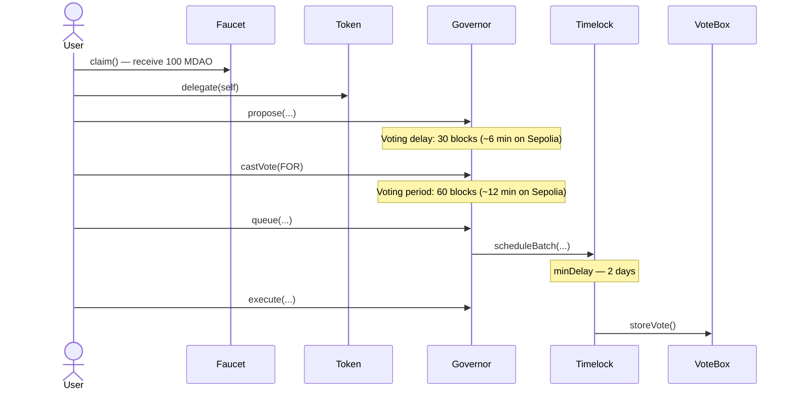

# Mini DAO

[](https://github.com/VxxxxC/mini_dao/actions/workflows/test.yml)

A full-stack Web3 governance platform built on **Ethereum Sepolia testnet**. It demonstrates the complete DAO governance lifecycle — from claiming tokens to executing an on-chain proposal through a time-locked controller.

> 🚨 **Demonstration only.** This project is deployed on Sepolia testnet for learning and showcase purposes. Completing the full voting workflow has no real-world effect.

---

## ✨ Features

- **Token Faucet** — Any address can claim 100 MDAO governance tokens (one-time per wallet)
- **Self-delegation** — Auto-delegates voting power to yourself on claim, so you can vote immediately
- **Proposal creation** — Submit governance proposals stored as IPFS metadata, signed and verified by wallet signature
- **On-chain voting** — Cast For / Against / Abstain votes weighted by MDAO holdings
- **Live countdown timers** — Proposal cards tick down the voting delay and show real-time status
- **Wallet-reactive UI** — Automatically re-checks vote status when MetaMask account switches
- **Queue & Execute flow** — Succeeded proposals surface Queue/Execute buttons and route through a TimelockController
- **Dark mode** — Full dark/light toggle with consistent Tailwind theming across all pages
- **Dual test suite** — Foundry contract tests + Vitest frontend component tests

---

## 📁 Structure

```
mini_dao/
├── contracts/          # Solidity smart contracts (Foundry)
│   ├── src/            # Contract source files
│   ├── test/           # Foundry tests (unit / fuzz / invariant / security)
│   └── script/         # Deployment scripts
├── src/                # SvelteKit frontend
│   ├── lib/
│   │   ├── components/ # UI components
│   │   ├── config/     # Viem, AppKit, env config
│   │   └── contracts_abi/ # Compiled ABI JSON
│   └── routes/         # Pages & API endpoints
└── tests/              # Vitest frontend tests
```

---

## 🛠 Stack

| Layer           | Tech                                                            |
| --------------- | --------------------------------------------------------------- |
| Smart Contracts | Solidity ^0.8.27, Foundry, OpenZeppelin ^5.x                    |
| Frontend        | SvelteKit v2 + Svelte 5, TypeScript, Tailwind CSS v4            |
| Web3            | Wagmi v3 + Viem v2, Reown AppKit                                |
| Storage         | Filebase / IPFS (off-chain proposal metadata)                   |
| Testing         | Foundry (contracts) · Vitest + vitest-browser-svelte (frontend) |

---

## 🔄 Governance Flow



---

## ⚠️ Demo Configuration

> The governance parameters are intentionally shortened for demonstration. **Do not use these values on mainnet.**

| Parameter        | Demo (Sepolia)                                                       | Recommended for Production    |
| ---------------- | -------------------------------------------------------------------- | ----------------------------- |
| Voting delay     | **30 blocks** (~6 min on Sepolia, ~60s on Anvil w/ 2s block time)    | 1 day minimum                 |
| Voting period    | **60 blocks** (~12 min on Sepolia, ~2 min on Anvil w/ 2s block time) | 1 week minimum                |
| Quorum           | **300 MDAO** (≈ 3 wallets × 100 MDAO)                                | `GovernorVotesQuorumFraction` |
| Min voting power | **≥ 10 MDAO**                                                        | project-defined               |

> ⚠️ `votingDelay` and `votingPeriod` return **block counts**, not seconds. Effective wall-clock time depends on the network's block time (Sepolia ≈ 12s/block, Anvil default ≈ instant — use `anvil --block-time 2` locally).

---

## 🚀 Local Setup

**Prerequisites:** [Bun](https://bun.sh) · [Foundry](https://getfoundry.sh)

```bash
git clone https://github.com/VxxxxC/mini_dao.git && cd mini_dao
bun install
```

Create `.env`:

```env
VITE_APPKIT_PROJECT_ID=<reown_project_id>
FILEBASE_ACCESS_KEY=<filebase_key>
FILEBASE_SECRET_KEY=<filebase_secret>
FILEBASE_BUCKET_NAME=<bucket_name>
```

```bash
# Terminal 1
anvil --block-time 2

# Terminal 2
cd contracts && make deploy-anvil-contract && make build

# Terminal 3
bun dev
```

Open [http://localhost:5173](http://localhost:5173).

---

## 🧪 Testing

```bash
# Smart contracts
cd contracts && forge test -vv

# Frontend
bun run test
```
