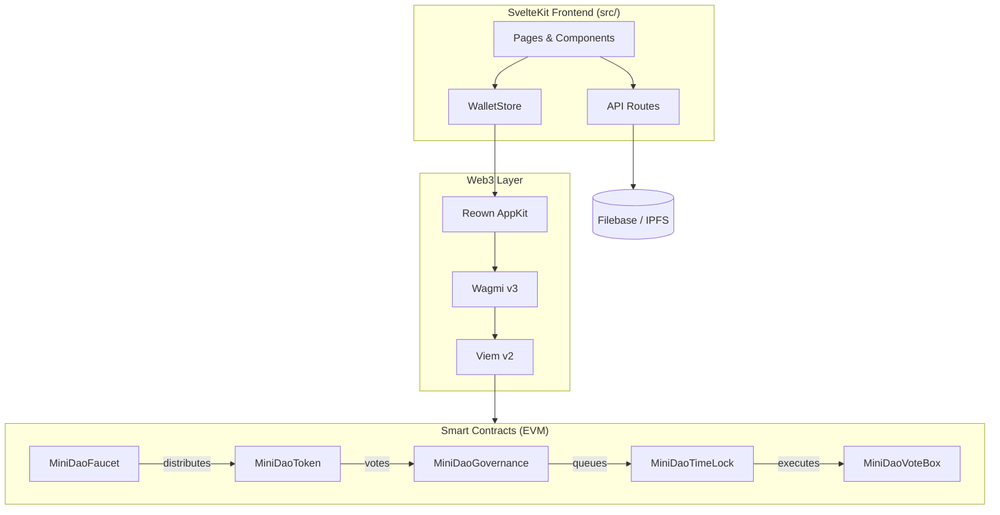
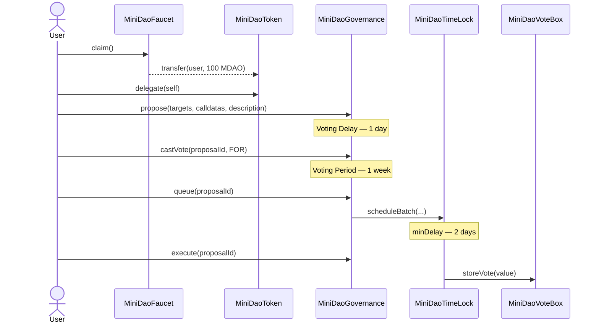

# Mini DAO

A full-stack Web3 governance platform. Community members claim governance tokens, delegate voting power, create proposals, vote, and execute approved actions on-chain through a timelock.

---

## Project Structure

```
contracts/          Foundry — Solidity smart contracts, scripts, tests
src/                SvelteKit — frontend UI, wallet integration, API routes
```

### Contracts

| Contract | Description |
|---|---|
| `MiniDaoToken` | ERC20 governance token (MDAO, 1B supply). 30% → faucet, 70% → treasury (timelock). |
| `MiniDaoTimeLock` | `TimelockController`. 2-day minDelay gates all on-chain execution. |
| `MiniDaoGovernance` | Governor. 1-day voting delay, 1-week voting period, 5-token quorum. |
| `MiniDaoFaucet` | One-time claim of 100 MDAO per address. |
| `MiniDaoVoteBox` | Governance-controlled vote store. Owned by the timelock. |

Deployment order: **Timelock → Token → Faucet → Governance → VoteBox**

### Frontend Stack

| Layer | Technology |
|---|---|
| Framework | SvelteKit v2 + TypeScript strict |
| UI | Tailwind CSS v4 + Flowbite-Svelte |
| Web3 | Wagmi v3 + Viem v2 + Reown AppKit |
| Storage | Filebase SDK (IPFS) |
| Deploy | Vercel adapter |

---

## Architecture



---

## Governance Flow



---

## Local Development

**Prerequisites**: [Bun](https://bun.sh/) · [Foundry](https://book.getfoundry.sh/getting-started/installation)

```sh
# 1. Start local EVM node
anvil

# 2. Deploy contracts
cd contracts
forge script script/DeployDao.s.sol --rpc-url http://localhost:8545 --private-key <ANVIL_KEY> --broadcast

# 3. Install & run frontend
bun install
bun run dev
```

**`.env`** (project root):

```env
VITE_APPKIT_PROJECT_ID=<your_reown_project_id>
VITE_SEPOLIA_RPC_URL=<your_sepolia_rpc_url>
```

---

## Contract Development

```sh
cd contracts
forge build        # compile
forge test -vvv    # run tests
forge fmt          # format
forge snapshot     # gas snapshot
```

See [contracts/README.md](contracts/README.md) for full reference.

---

## Building for Production

```sh
bun run build
bun run preview
```

> Update `appKitConfig.ts` and `src/lib/config/viem/client.ts` from Anvil to your target network before deploying.

---

## Code Audit

### Pros

- **Decentralized by design** — deployer revokes `DEFAULT_ADMIN_ROLE` post-deploy; all mutations flow through Governor → Timelock.
- **OpenZeppelin base** — uses audited `Governor`, `TimelockController`, `ERC20Votes`, `ERC20Permit`; minimal custom logic.
- **Custom errors** — gas-efficient reverts (`AlreadyClaimed`, `TransferFailed`, `FaucetEmpty`); no `require` strings.
- **Signature verification** — off-chain proposals verify wallet signature + 5-min expiry server-side before any IPFS write.
- **E2E test coverage** — `MiniDaoTest.t.sol` covers the full cycle: deploy → claim → delegate → propose → vote → queue → execute.
- **Network isolation** — `HelperConfig.s.sol` separates Anvil / Sepolia params; no hardcoded addresses in scripts.
- **Type-safe frontend** — strict TypeScript, `.t.ts` type files, ABI JSON with module resolution.

### Cons

- **Hardcoded quorum** — `QUORUM_VOTES = 5 tokens` is static; `GovernorVotesQuorumFraction` would scale with supply.
- **Mock data** — proposal pages use `src/lib/mock_data.ts`; live IPFS API calls not yet wired up.
- **Trivial governance target** — `VoteBox` demonstrates the flow but has no real-world impact.
- **No on-chain/off-chain linkage** — IPFS proposals are not cryptographically tied to an on-chain `proposalId`.
- **Dual hardcoded network** — both `appKitConfig.ts` and `viem/client.ts` must be changed for production separately.

### Tagged Findings

> ⚠️ **Critical** — items marked `BUG` or `FIX` affect live user experience and must be resolved before production.

#### 🔴 `BUG`
| File | Line | Description |
|---|---|---|
| [Navbar.svelte](src/lib/components/Navbar.svelte#L100) | 100 | Wallet modal overlay conflicts with hamburger dropdown (z-index / event propagation) |

#### 🟠 `FIX`
| File | Line | Description |
|---|---|---|
| [HomeProposalCard.svelte](src/lib/components/HomeProposalCard.svelte#L27) | 27 | Date/time formatting broken — replace with `Intl.DateTimeFormat` or `toLocaleDateString` |
| [ProposalCard.svelte](src/lib/components/ProposalCard.svelte#L43) | 43 | Same date/time formatting issue |

#### 🟡 `WARN`
| File | Line | Description |
|---|---|---|
| [MiniDaoGovernance.sol](contracts/src/MiniDaoGovernance.sol#L22) | 22 | `QUORUM_VOTES` hardcoded — replace with `GovernorVotesQuorumFraction` |
| [MiniDaoVoteBox.sol](contracts/src/MiniDaoVoteBox.sol#L12) | 12 | Initial owner is `msg.sender`; transfer to timelock post-deploy |
| [appKitConfig.ts](src/lib/config/appKitConfig.ts#L12) | 12, 20 | Network hardcoded to Anvil — switch before production |
| [viem/client.ts](src/lib/config/viem/client.ts#L5) | 5 | Network hardcoded to Anvil — switch before production |

#### 🔵 `IMPORTANT`
| File | Line | Description |
|---|---|---|
| [upload_to_ipfs.ts](src/routes/api/upload_proposal/upload_to_ipfs.ts#L17) | 17 | Signature expiry check — rejects requests older than 5 minutes |
| [upload_to_ipfs.ts](src/routes/api/upload_proposal/upload_to_ipfs.ts#L26) | 26 | Signature verification via `verifyMessage` |
| [upload_to_ipfs.ts](src/routes/api/upload_proposal/upload_to_ipfs.ts#L73) | 73 | IPFS CID extracted from Filebase response header |

